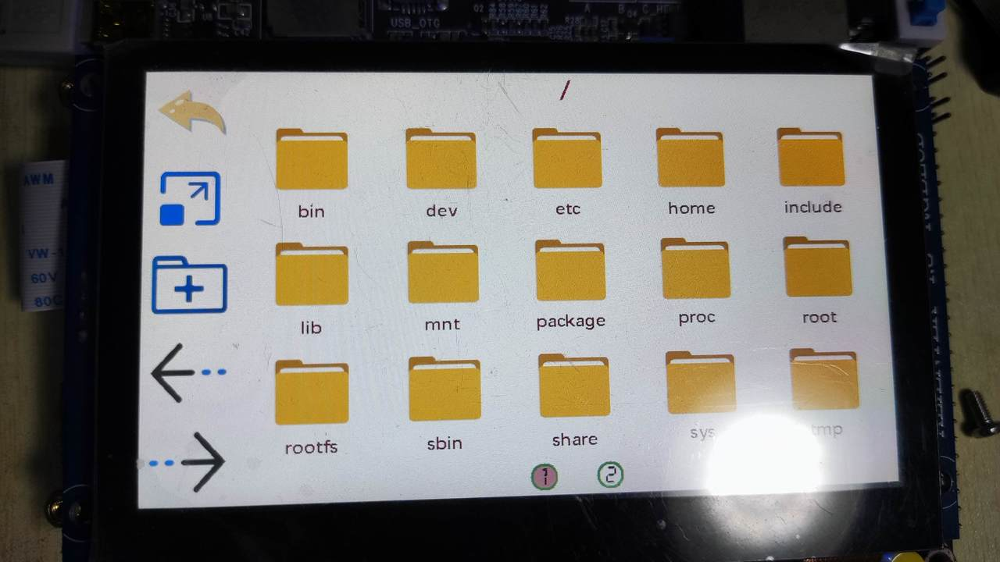
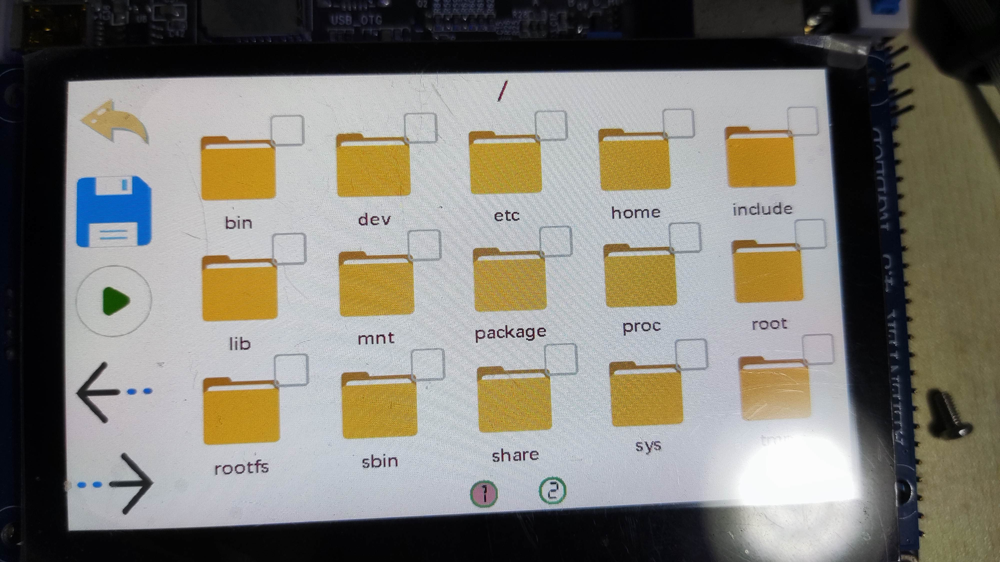
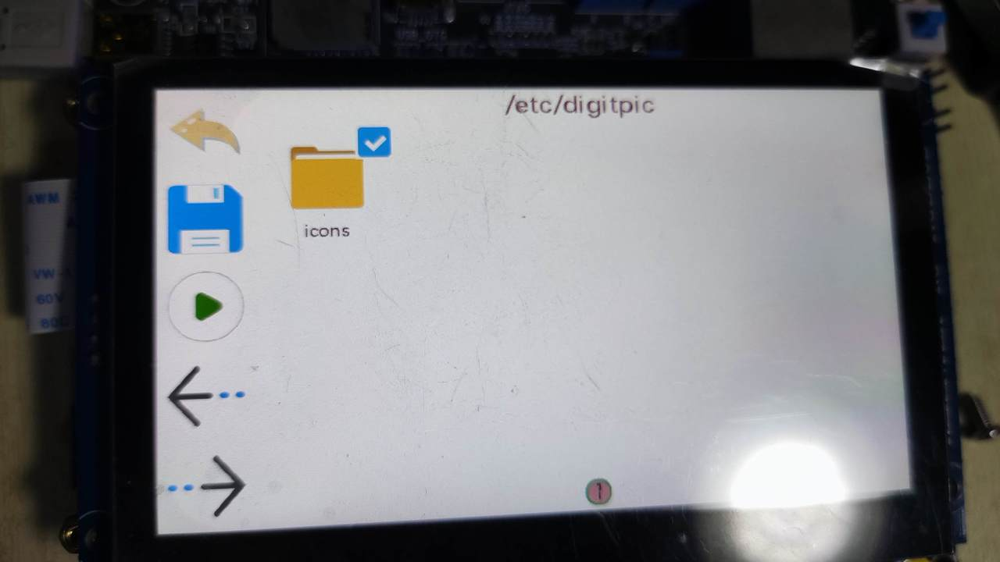
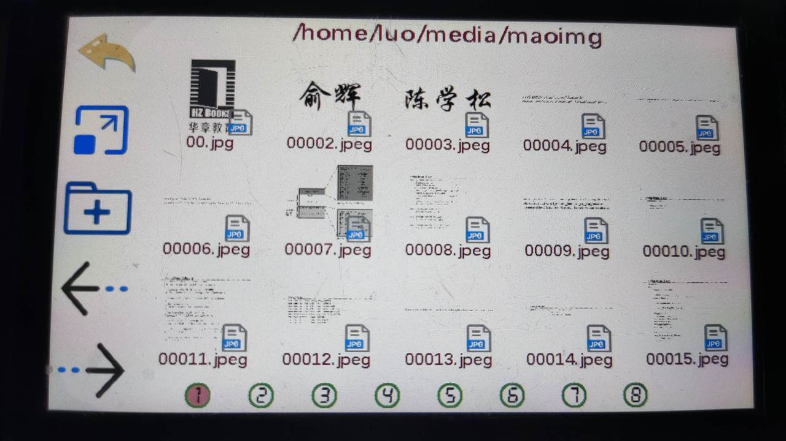
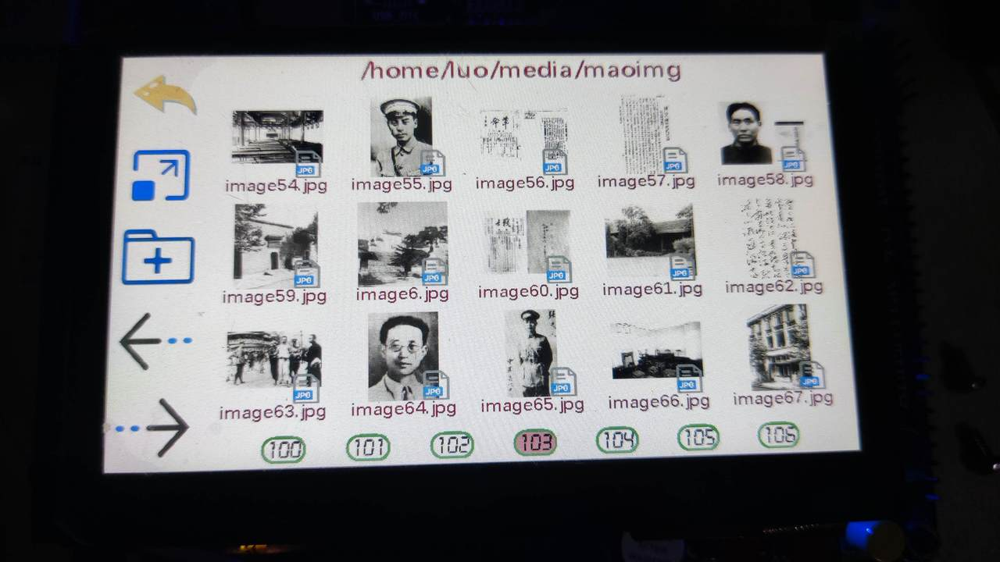
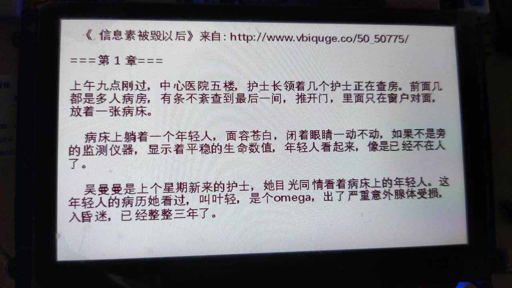
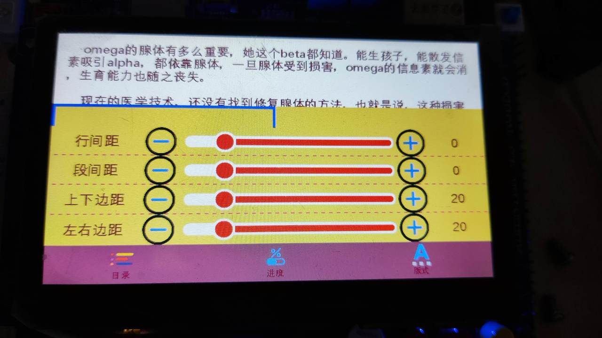
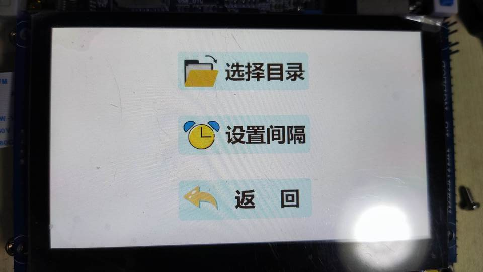

# 功能介绍
启动程序会进入主界面，如下图： 
 

在此界面中有3个按钮： 
* 浏览目录 —— 浏览文件和目录，打开图片。 
* 连播模式 —— 如果已经选择了目录，则按一定时间间隔循环显示目录中的图片。 
* 设置 —— 设置连播目录，连播时的时间间隔。 

## 浏览目录
点击“浏览目录”按钮后进入浏览页面，如下图： 
 

此页面大体可分为四个区域：  
1. 左侧为5个菜单图标，从上到下依次对应的功能分别为：  
   1. 返回上级目录；
   2. 放大或缩小图标（实际上该功能未实现）；
   3. 选择连播目录，点击后进入文件夹选择状态，如下图:   
       
       点击文件夹图标右上角的选择框即可完成选择，可选择多个，如下图：  
       
       选择好文件夹后可根据需要点击右侧菜单进行保存（从上数第二个图标）或者直接开始连播所选文件内的图片（从上数第三个图标）。  
   4. 上一页 ；
   5. 下一页。
2. 右边上面显示当前的所在的文件的路径；  
3. 右边主体显示文件夹和文件图片，目前只支持几种常见图片格式和文本文件。当文件为支持的图片文件，可以直接显示预览图：

4. 右边下面是页码，这里的页码是动态生成的，距离会自动调整，数字用图片拼成，圆角矩形框是用函数动态生成，如下是页数超过一百时的情况：

### 预览图  
预览图的显示使用了一个特定的线程，因为如果将所有图片的预览图都生成好后再刷新到屏幕显存上，如果图片都是十多兆的大小，那么显示速度将慢的让人难以忍受。所以在这里，最开始都是只先渲染图标然后显示到屏幕上，因为图标已被缓存到内存中，这会很快。  
然后预览图线程会检查当前浏览的目录中的是否有能识别的图片，如果有，则读入该图片并缩放至合适大小，然后显示。预览图会被缓存，直到缓存的预览图所占内存超过预设值，或者已经进入到其他目录或者已进入到其他页面，这时会释放原先的缓存并重新生成。
如果一直没有操作，预览图线程会一直为当前目录下其他尚未被显示的图片生成缓存，以加快速度，直到缓存的预览图所占内存超过预设值。每当点击“上一页”、“下一页”或进入其他目录，预览图线程会重新检查当前页面是否生成了预览图，这期间要使用互斥量。
### 浏览图片
当点击图片文件时，会进入图片浏览页面，当前支持的图片格式有：jpeg、png、bmp和gif动图。下面是显示的一张图：

此页面可分为两个区域：  
1. 左侧为5个菜单图标，从上到下依次对应的功能分别为：
   1. 返回
   2. 从当前图片开始连播当前目录下的图片；
   3. 上一张；
   4. 下一张；
   5. 更多，点击后会展开以下几个额外的菜单：放大、缩小、左旋90度、右旋90度、将当前图片位置的大小复位为初始值。如下图：
      
2. 右边主体的图片显示区域，可在此区域滑动以拖动图片，但不支持两指放大和缩小。
### gif动图
支持gif图片。也是用一个特定线程来显示gif图片。显示图片时会有一个保存当前图片名称的全局变量，每当打开一张gif图，会检查当前打开的图片和当前正要被显示的图片是否一致，如果一致则从线程池中唤醒一个线程以动态显示图片。对应gif线程，它以给定的时间间隔往显存上刷新图片，显示图片之前会检查是否切换的图片，当然这要用互斥量保护。对于动图同样可以放大或缩小。
### 浏览文本文档
可浏览utf-8、utf-16、ascii编码的文本,如下图所示：  

点击左右两边进行翻页，点击中间区域可唤起菜单，如下图：

由于时间关系，这里并未对应功能的具体实现。
## 连播
点击此按钮后，看情况有两种可能：  
- 如果已经设置过连播目录，会直接开始连播该目录下的图片；
- 如果未设置连播目录，会进入“浏览页面”来选择要连播的目录：  
 
## 设置
这里主要设置两项，要连播哪些目录下的图片，以及两张图片显示之间的间隔，如下图：

- 点击“选择目录”还是会进入“浏览页面”来选择要连播的目录。
- 点击“设置间隔”开始设置连播间隔，单位为秒，如下：

